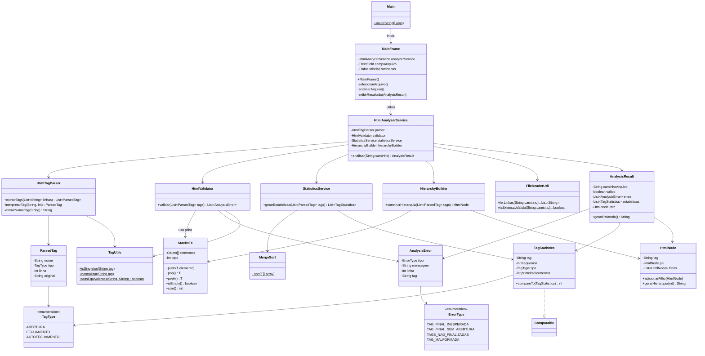
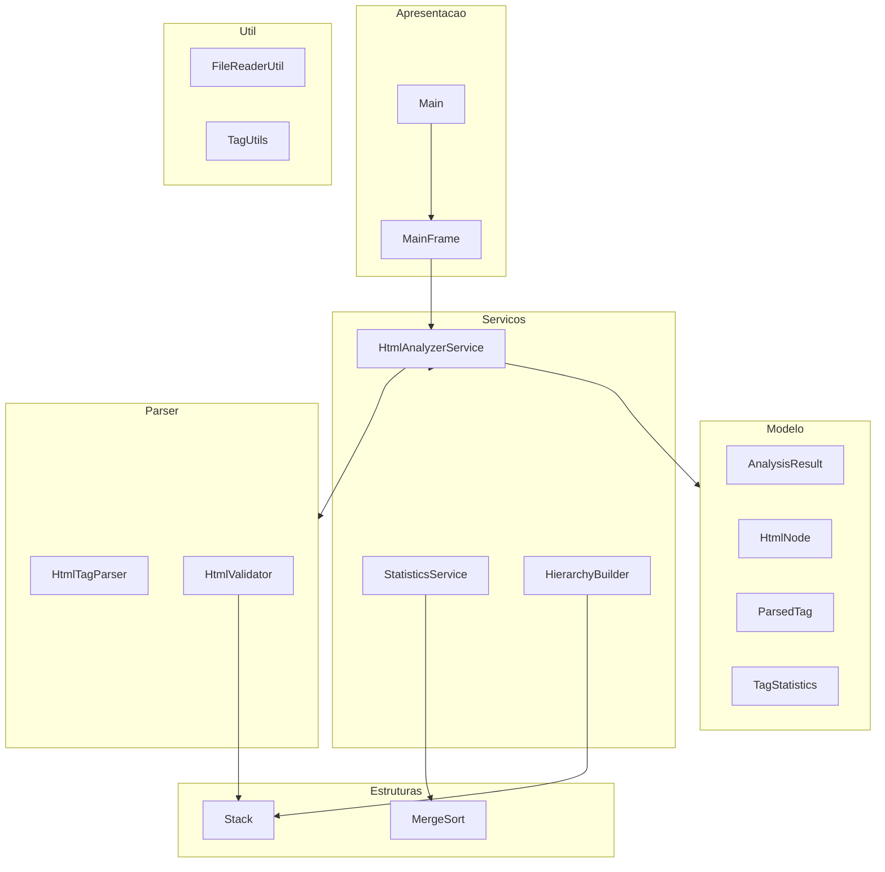
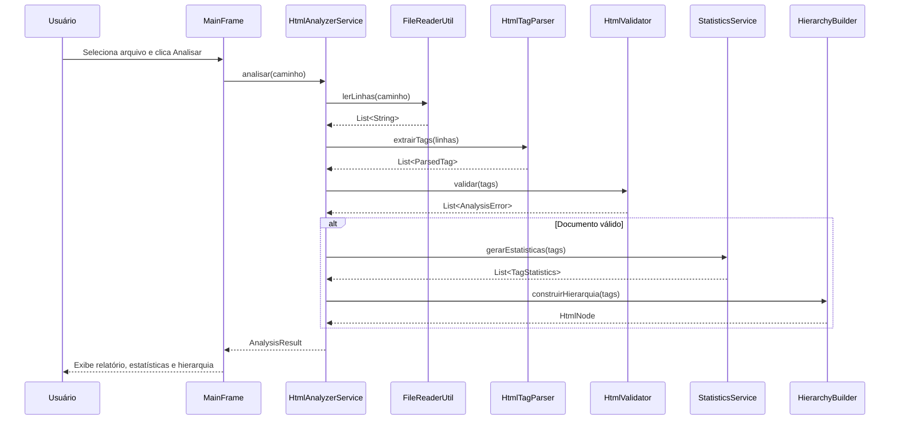

# Diagrama UML - Analisador de HTML

## Diagrama de Classes

```mermaid
classDiagram
    direction TB

    class Main {
        +main(String[] args)$
    }

    class MainFrame {
        -HtmlAnalyzerService analyzerService
        -JTextField campoArquivo
        -JTable tabelaEstatisticas
        +MainFrame()
        -selecionarArquivo()
        -analisarArquivo()
        -exibirResultado(AnalysisResult)
    }

    class HtmlAnalyzerService {
        -HtmlTagParser parser
        -HtmlValidator validator
        -StatisticsService statisticsService
        -HierarchyBuilder hierarchyBuilder
        +analisar(String caminho) AnalysisResult
    }

    class HtmlTagParser {
        +extrairTags(List~String~ linhas) List~ParsedTag~
        -interpretarTag(String, int) ParsedTag
        -extrairNomeTag(String) String
    }

    class HtmlValidator {
        +validar(List~ParsedTag~ tags) List~AnalysisError~
    }

    class StatisticsService {
        +gerarEstatisticas(List~ParsedTag~ tags) List~TagStatistics~
    }

    class HierarchyBuilder {
        +construirHierarquia(List~ParsedTag~ tags) HtmlNode
    }

    class Stack~T~ {
        -Object[] elementos
        -int topo
        +push(T elemento)
        +pop() T
        +peek() T
        +isEmpty() boolean
        +size() int
    }

    class MergeSort {
        +sort(T[] array)$
    }

    class AnalysisResult {
        -String caminhoArquivo
        -boolean valido
        -List~AnalysisError~ erros
        -List~TagStatistics~ estatisticas
        -HtmlNode raiz
        +gerarRelatorio() String
    }

    class AnalysisError {
        -ErrorType tipo
        -String mensagem
        -int linha
        -String tag
    }

    class HtmlNode {
        -String tag
        -HtmlNode pai
        -List~HtmlNode~ filhos
        +adicionarFilho(HtmlNode)
        +gerarHierarquia(int) String
    }

    class ParsedTag {
        -String nome
        -TagType tipo
        -int linha
        -String original
    }

    class TagStatistics {
        -String tag
        -int frequencia
        -TagType tipo
        -int primeiraOcorrencia
        +compareTo(TagStatistics) int
    }

    class TagType {
        <<enumeration>>
        ABERTURA
        FECHAMENTO
        AUTOFECHAMENTO
    }

    class ErrorType {
        <<enumeration>>
        TAG_FINAL_INESPERADA
        TAG_FINAL_SEM_ABERTURA
        TAGS_NAO_FINALIZADAS
        TAG_MALFORMADA
    }

    class FileReaderUtil {
        +lerLinhas(String caminho)$ List~String~
        +isExtensaoValida(String caminho)$ boolean
    }

    class TagUtils {
        +isSingleton(String tag)$
        +normalizar(String tag)$
        +tagsEquivalentes(String, String)$ boolean
    }

    Main --> MainFrame : inicia
    MainFrame --> HtmlAnalyzerService : utiliza
    HtmlAnalyzerService --> HtmlTagParser
    HtmlAnalyzerService --> HtmlValidator
    HtmlAnalyzerService --> StatisticsService
    HtmlAnalyzerService --> HierarchyBuilder
    HtmlAnalyzerService --> FileReaderUtil
    HtmlAnalyzerService --> AnalysisResult

    HtmlValidator --> Stack : usa pilha
    HtmlValidator --> AnalysisError
    HtmlValidator --> TagUtils

    HtmlTagParser --> ParsedTag
    HtmlTagParser --> TagUtils

    StatisticsService --> MergeSort
    StatisticsService --> TagStatistics

    HierarchyBuilder --> Stack
    HierarchyBuilder --> HtmlNode

    AnalysisResult --> AnalysisError
    AnalysisResult --> TagStatistics
    AnalysisResult --> HtmlNode

    AnalysisError --> ErrorType
    ParsedTag --> TagType
    TagStatistics --> TagType
    TagStatistics ..|> Comparable
```

## Diagrama de Pacotes

```mermaid
graph TB
    subgraph Apresentacao
        Main
        MainFrame
    end

    subgraph Servicos
        HtmlAnalyzerService
        StatisticsService
        HierarchyBuilder
    end

    subgraph Parser
        HtmlTagParser
        HtmlValidator
    end

    subgraph Modelo
        AnalysisResult
        HtmlNode
        ParsedTag
        TagStatistics
    end

    subgraph Estruturas
        Stack
        MergeSort
    end

    subgraph Util
        FileReaderUtil
        TagUtils
    end

    Main --> MainFrame
    MainFrame --> HtmlAnalyzerService
    HtmlAnalyzerService --> Parser
    HtmlAnalyzerService --> Servicos
    HtmlAnalyzerService --> Modelo
    HtmlValidator --> Stack
    StatisticsService --> MergeSort
    HierarchyBuilder --> Stack
```

## Diagrama de Sequência - Análise de Arquivo

```mermaid
sequenceDiagram
    participant U as Usuário
    participant UI as MainFrame
    participant S as HtmlAnalyzerService
    participant F as FileReaderUtil
    participant P as HtmlTagParser
    participant V as HtmlValidator
    participant ST as StatisticsService
    participant H as HierarchyBuilder

    U->>UI: Seleciona arquivo e clica Analisar
    UI->>S: analisar(caminho)
    S->>F: lerLinhas(caminho)
    F-->>S: List<String>
    S->>P: extrairTags(linhas)
    P-->>S: List<ParsedTag>
    S->>V: validar(tags)
    V-->>S: List<AnalysisError>

    alt Documento válido
        S->>ST: gerarEstatisticas(tags)
        ST-->>S: List<TagStatistics>
        S->>H: construirHierarquia(tags)
        H-->>S: HtmlNode
    end

    S-->>UI: AnalysisResult
    UI-->>U: Exibe relatório, estatísticas e hierarquia
```
