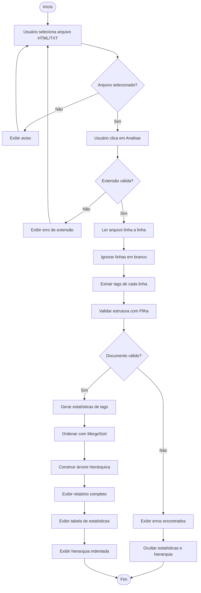
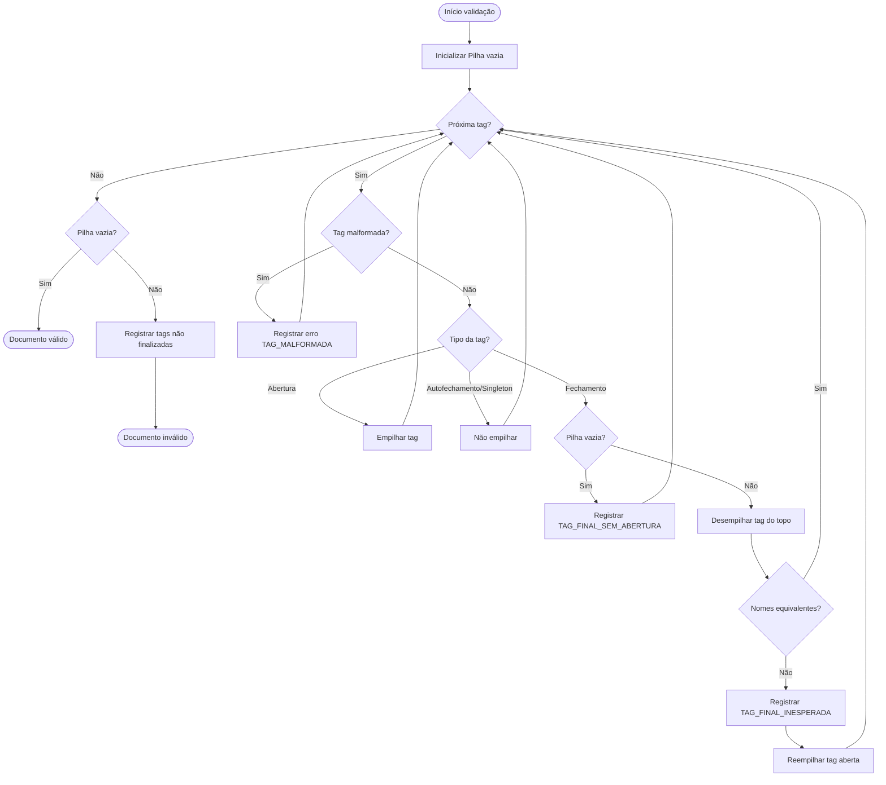
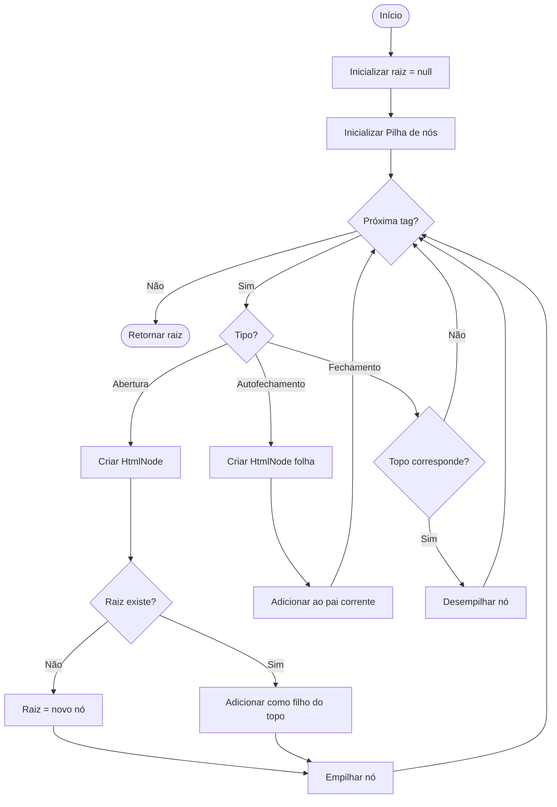
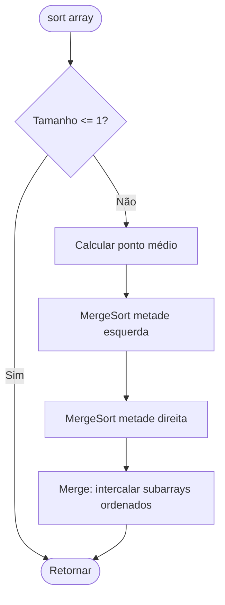

# Fluxograma - Analisador de HTML

## Fluxo Principal da Aplicação

```mermaid
flowchart TD
    A([Início]) --> B[Usuário seleciona arquivo HTML/TXT]
    B --> C{Arquivo selecionado?}
    C -->|Não| D[Exibir aviso]
    D --> B
    C -->|Sim| E[Usuário clica em Analisar]
    E --> F{Extensão válida?}
    F -->|Não| G[Exibir erro de extensão]
    G --> B
    F -->|Sim| H[Ler arquivo linha a linha]
    H --> I[Ignorar linhas em branco]
    I --> J[Extrair tags de cada linha]
    J --> K[Validar estrutura com Pilha]
    K --> L{Documento válido?}
    L -->|Não| M[Exibir erros encontrados]
    M --> N[Ocultar estatísticas e hierarquia]
    N --> O([Fim])
    L -->|Sim| P[Gerar estatísticas de tags]
    P --> Q[Ordenar com MergeSort]
    Q --> R[Construir árvore hierárquica]
    R --> S[Exibir relatório completo]
    S --> T[Exibir tabela de estatísticas]
    T --> U[Exibir hierarquia indentada]
    U --> O
```

## Fluxo de Validação com Pilha

```mermaid
flowchart TD
    A([Início validação]) --> B[Inicializar Pilha vazia]
    B --> C{Próxima tag?}
    C -->|Não| D{Pilha vazia?}
    D -->|Sim| E([Documento válido])
    D -->|Não| F[Registrar tags não finalizadas]
    F --> G([Documento inválido])
    C -->|Sim| H{Tag malformada?}
    H -->|Sim| I[Registrar erro TAG_MALFORMADA]
    I --> C
    H -->|Não| J{Tipo da tag?}
    J -->|Abertura| K[Empilhar tag]
    K --> C
    J -->|Autofechamento/Singleton| L[Não empilhar]
    L --> C
    J -->|Fechamento| M{Pilha vazia?}
    M -->|Sim| N[Registrar TAG_FINAL_SEM_ABERTURA]
    N --> C
    M -->|Não| O[Desempilhar tag do topo]
    O --> P{Nomes equivalentes?}
    P -->|Sim| C
    P -->|Não| Q[Registrar TAG_FINAL_INESPERADA]
    Q --> R[Reempilhar tag aberta]
    R --> C
```

## Fluxo de Construção da Hierarquia

```mermaid
flowchart TD
    A([Início]) --> B[Inicializar raiz = null]
    B --> C[Inicializar Pilha de nós]
    C --> D{Próxima tag?}
    D -->|Não| E([Retornar raiz])
    D -->|Sim| F{Tipo?}
    F -->|Abertura| G[Criar HtmlNode]
    G --> H{Raiz existe?}
    H -->|Não| I[Raiz = novo nó]
    H -->|Sim| J[Adicionar como filho do topo]
    I --> K[Empilhar nó]
    J --> K
    K --> D
    F -->|Autofechamento| L[Criar HtmlNode folha]
    L --> M[Adicionar ao pai corrente]
    M --> D
    F -->|Fechamento| N{Topo corresponde?}
    N -->|Sim| O[Desempilhar nó]
    N -->|Não| D
    O --> D
```

## Fluxo do MergeSort

```mermaid
flowchart TD
    A([sort array]) --> B{Tamanho <= 1?}
    B -->|Sim| C([Retornar])
    B -->|Não| D[Calcular ponto médio]
    D --> E[MergeSort metade esquerda]
    E --> F[MergeSort metade direita]
    F --> G[Merge: intercalar subarrays ordenados]
    G --> C
```
